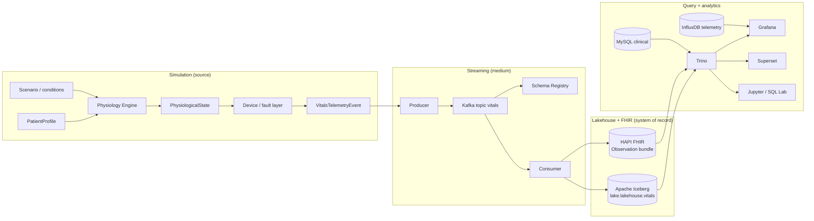

# Architecture

This document describes the logical architecture of the Healthcare Time-Series
Lab: the components that exist, the layers they are organized into, and the
key decisions that shape the codebase.

- [Overview](#overview)
- [Design principle](#design-principle)
- [High-level component map](#high-level-component-map)
- [Layers](#layers)
- [Key decisions](#key-decisions)
- [Known gaps](#known-gaps)

## Overview

The lab is a reproducible, containerized platform for learning modern
time-series software engineering. It generates **synthetic physiological
telemetry** for fictional patients, moves it through a streaming and lakehouse
stack, and exposes it through a variety of query and visualization surfaces.
Everything is deterministic and re-runnable: the same inputs produce the same
traces, tables, and dashboards.

The pipeline is batch-oriented today. Simulation runs are finite
(`scripts/run_pipeline.py`, `scripts/run_baseline.py`, ...) and each run writes
an immutable batch of telemetry. There is no continuously running producer.

## Design principle

> Model a **patient plus a clinical condition**, then turn that into observed
> telemetry. Do not script fixed waveforms.

Each patient carries a physiological baseline (heart rate, SpO2, respiratory
rate, temperature, blood pressure). A **condition** transforms that baseline
over time as a set of clinical parameters with onset, duration, and severity
(e.g. `progressive_hypoxemia`, `tachycardia`). The physiology engine integrates
baseline plus condition plus per-patient noise into a sequence of true
physiological states; the **device layer** then models how a bedside monitor
would actually report those states (sampling rate, precision, measurement
error, dropout, and fault states).

Separating *true physiology* from *observed device data* is deliberate: it lets
advanced lessons benchmark device fidelity by comparing `vitals` (observed)
against `vitals_truth` (true).

* Source of truth for this rule: `src/healthcare_timeseries_lab/physiology/`,
  `src/healthcare_timeseries_lab/scenarios/`, `src/healthcare_timeseries_lab/device/`.

## High-level component map

Trino is the single query gateway across all stores (Iceberg via MinIO,
MySQL, FHIR Postgres). Grafana additionally reads InfluxDB for the low-latency
vitals dashboard.

## Layers

### Simulation

| Package | Responsibilities |
|---------|------------------|
| `patients` | `PatientProfile` demographics, MRNs, and pipeline behavior |
| `physiology` | `PhysiologyEngine` produces true `PhysiologicalState` trajectories; bounds and invariant validation |
| `scenarios` | `ScenarioEngine`, condition libraries (`library.py`), `ScenarioConfig` |
| `simulation` | `pipeline.py` orchestrates a run; `runner.py`, `scenario_runner.py`, `ScenarioSimulationConfig`; `models.py` output contracts |
| `runtime` | `SimulationClock` for ticked time |
| `device` | `BedsideMonitor` sampling, precision, defaults, fault layer; `models.py` device/quality codes |
| `telemetry` | `VitalsTelemetryEvent` and topic/key conventions (`events.py`) |
| `ground_truth` | `vitals_truth` writer and truth models for device-fidelity benchmarking |
| `analysis` | `metrics.py`, `alignment.py` used by truth-vs-device comparisons (M9) |

### Streaming

| Component | Details |
|-----------|---------|
| `streaming/schema.py` | Avro schema for vitals (mirrors the 6 vitals channels) |
| `streaming/producer.py` | Serializes `VitalsTelemetryEvent` to Avro, produces to Kafka `vitals` topic |
| `streaming/consumer.py` | Consumes, writes batch rows via Trino INSERT into Iceberg, and builds FHIR Observation bundles |
| Kafka + Schema Registry | Single broker (`htl-kafka`), registry on `:8081` |

### Lakehouse & FHIR

| Entity | Store | Table(s) |
|--------|-------|----------|
| Iceberg warehouse | MinIO-backed, catalog in Postgres | `lake.lakehouse.vitals`, `lake.lakehouse.vitals_truth` |
| FHIR | HAPI FHIR JPA (Postgres) | Observation resources (bundle type 85353-1) |
| Clinical | MySQL | `mysql.clinical.patients`, `mysql.clinical.encounters` |

Lakehouse DDL, catalogs, and the FHIR LOINC mapping live in
`src/healthcare_timeseries_lab/lakehouse/__init__.py`; the writer in
`lakehouse/writer.py`.

### Query & analytics

- Trino CLI / Python (`trino` driver), SQL Lab
- Jupyter notebooks (M6/M9/M10)
- Grafana (provisioned datasource + 8-panel dashboards)
- Superset (6 dashboards created programmatically via the Superset REST API)

## Key decisions

1. **Seeded determinism.** Every run seeds its RNG (per patient/run seeds);
   event IDs are UUID5-derived so identical runs produce identical keys. See
   [reliability](reliability.md).
2. **Device layer separate from physiology.** True states and observed
   telemetry are distinct models, storage, and query surfaces.
3. **Batch, not streaming-first.** A finite simulation run drives the whole
   chain; streaming primitives (Kafka, Schema Registry, producer/consumer)
   still exercise the streaming pattern without a live feed.
4. **Trino as the unified query gateway.** Iceberg, MySQL, and FHIR Postgres
   are all reachable via one SQL engine with a single shim between app code
   and storage.
5. **Programmatic Superset provisioning.** Charts/dashboards/datasets are
   created through the Superset REST API (`scripts/import_superset_dashboards.py`)
   or virtual-dataset SQL, keeping the workspace reproducible. The custom
   `infra/superset` image injects the `TrinoDialect` metrics fix.
6. **All infrastructure declared in `docker-compose*.yml` + `infra/`.** No
   manual service configuration; `Makefile` + `scripts/init_infra.py`
   bootstrap health, buckets, and catalogs.

## Known gaps

- No continuously running producer; dashboards show static batches (charts do
  not tick live).
- No waveform data, interventions, or multi-day history (single ~6-hour window).
- Clinical store has no foreign keys for reports (columns are plain `NOT NULL`).
- See [scope](scope.md) for the full boundaries.