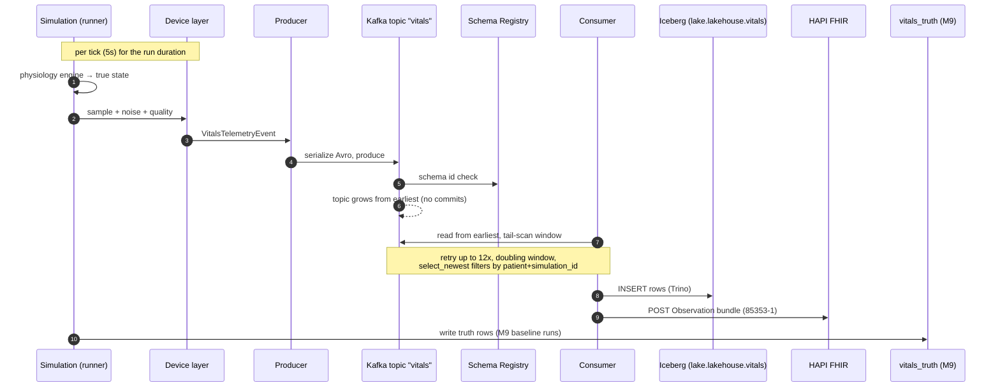
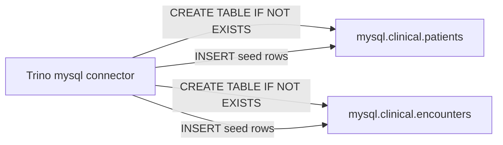
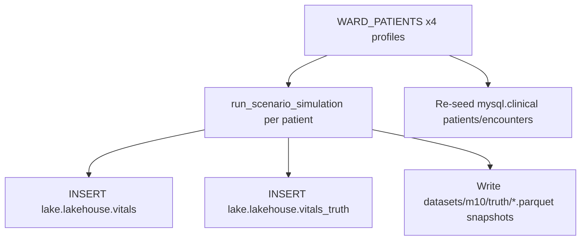
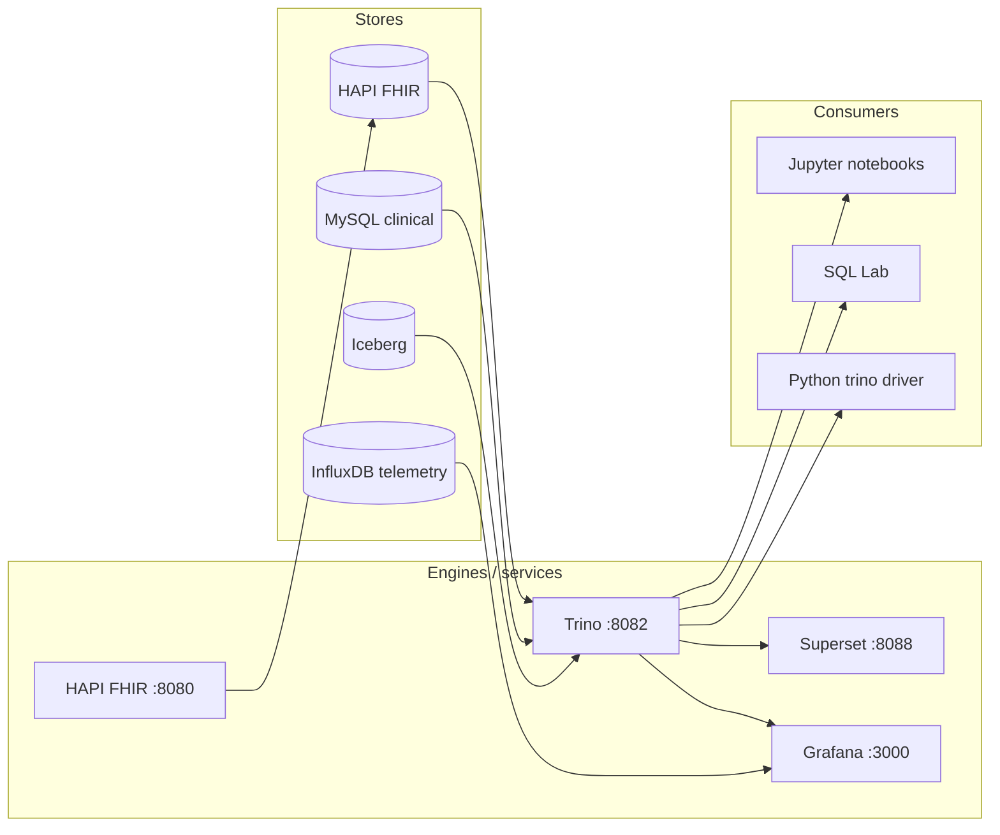

# Data Flow

This document describes how data moves through the lab: the batch simulation
pipeline, the clinical store, the Milestone 10 dataset generator, and the
read/query paths that consume what these write.

- [Overview](#overview)
- [Pipeline: simulate → Kafka → Iceberg → FHIR](#pipeline-simulate--kafka--iceberg--fhir)
- [Clinical store: patients and encounters](#clinical-store-patients-and-encounters)
- [Milestone 10 ward dataset](#milestone-10-ward-dataset)
- [Read and query paths](#read-and-query-paths)
- [Static, not live](#static-not-live)

## Overview

All data is produced by finite batch runs. There is no continuously running
producer; each script generates its own window of telemetry and terminates.
Run scripts (in `scripts/`) are re-runnable and idempotent where noted.

| Writer | Top-level script | What it writes |
|--------|------------------|----------------|
| M7/M8 pipeline | `run_pipeline.py` | `lake.lakehouse.vitals` + FHIR Observations |
| M5 clinical store | `run_clinical_store.py` | `mysql.clinical.patients/encounters` |
| M10 ward dataset | `generate_m10_dataset.py` | `vitals`, `vitals_truth`, clinical reseed, parquet snapshots |
| M9 truth baseline | `run_lakehouse_analytics.py` / notebooks | reads for benchmarking |

## Pipeline: simulate → Kafka → Iceberg → FHIR

The unified orchestrator is `simulation/pipeline.py:run_pipeline`, which wraps
each sim trace in streaming. All stage functions are injectable so unit tests
can run without infrastructure.

Flow details:

1. **Simulate.** `run_pipeline` delegates to `run_baseline_simulation` or
   `run_scenario_simulation` depending on `scenario_name`. Every event carries
   the surviving simulation id, device id, patient id, and a UUID5-derived
   event id.
2. **Produce.** `produce_vitals` serializes the event list to Avro and produces
   to the `vitals` topic (default `TOPIC_DEFAULT`).
3. **Consume.** The consumer reads the whole topic from `earliest` and does
   **not** commit offsets. Because earlier runs may still be on the topic, the
   orchestrator tail-scans: it reads a growing window (starting at
   `max(expected*4 + 1000, 500)`, doubling until covered, max 12 attempts) and
   keeps only records matching the current `(patient_id, simulation_id)`,
   sliced to the newest `expected` rows.
4. **Write.** Inserted rows are counted; a mismatch between simulated,
   consumed, and inserted raises `pipeline mismatch at the lakehouse sink`.
5. **FHIR.** `push_vitals_bundle` posts a single Observation bundle per batch
   with code 85353-1; `encounter_id` defaults to `enc-{simulation_id}`.
6. **Result.** `run_pipeline` returns a `PipelineResult` dataclass carrying
   the simulation run, events, ground truth, and per-sink counters
   (`produced`, `consumed`, `lakehouse_inserted`, `fhir_transactions`).

## Clinical store: patients and encounters

`scripts/run_clinical_store.py` provisions and seeds the MySQL-side relational
layer through Trino's `mysql` connector (Milestone 5).

- Tables are created via Trino's connector grammar: `TIMESTAMP` columns and
  plain `NOT NULL` (inline `PRIMARY KEY`/`DATETIME` are not supported through
  the connector).
- Seed rows live in `clinical/ddl.py` (`PATIENTS_SEED_ROWS`,
  `ENCOUNTERS_SEED_ROWS`). The M10 generator re-seeds these tables for its own
  MRNs only, leaving legacy rows intact.
- The `TrinoClinicalStore` (`clinical/queries.py`) exposes typed query helpers.

## Milestone 10 ward dataset

`scripts/generate_m10_dataset.py` builds the multi-patient ward used by the
business-question tutorials: three patients with distinct conditions and
vitals ranges, plus one scenario-control pairing.

- Time window: `2026-01-01 00:00 → ~06:00 UTC`, 5-second ticks.
- Ward: `11111111-...` (control), `55555555-...` (progressive hypoxemia),
  `66666666-...` and `77777777-...` (tachycardia variants). MRN range
  `MRN-0001xx`.
- `datasets/m10/truth/*.parquet` are local snapshots for offline reads that do
  not require a running warehouse.

## Read and query paths

- **Trino** is the gateway to Iceberg, MySQL, and FHIR Postgres for notebooks,
  the `trino` Python driver, Superset, and Grafana SQL panels.
- **Superset** datasets are created/used through its REST API; chart queries
  run against `lake.lakehouse.vitals` (see [infrastructure](infrastructure.md)).
- **Grafana**'s vital signs dashboard also reads InfluxDB (`telemetry` bucket),
  which is fed by the M6 exporter (batch, not streaming).

## Static, not live

Everything is baked by a batch run; dashboards show the last generated window.
Charts do not tick live, and Grafana InfluxDB panels have no live feeder.
The takeaways for pipelines in production (where a consumer would commit
offsets and a timer would drive ingestion) are modeled here as replays of the
same primitives.