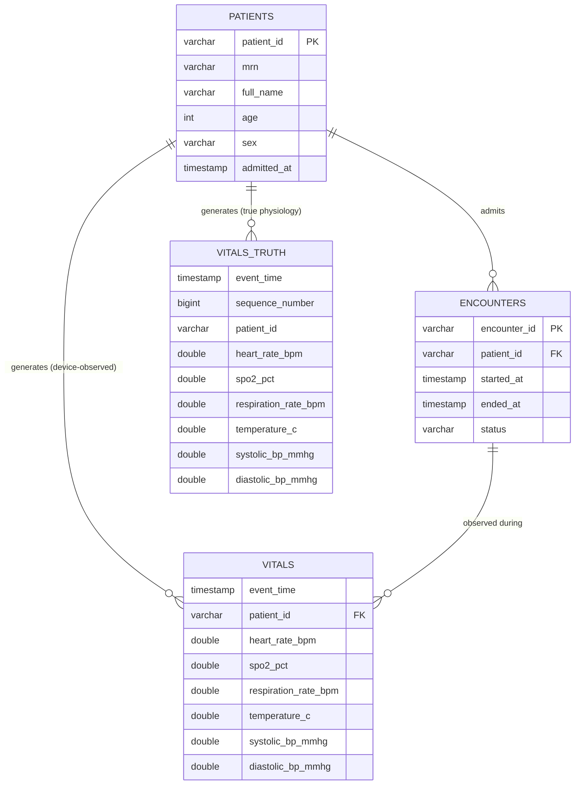

# Data Model

This document defines the persisted data model: Iceberg tables, the clinical
store, the Avro contract, the FHIR mapping, key entities, and conventions.
It is the reference for the SQL tutorials in `sql/dql/`.

- [Conventions](#conventions)
- [Entity model](#entity-model)
- [Tables](#tables)
- [Avro contract](#avro-contract)
- [FHIR / LOINC mapping](#fhir--loinc-mapping)
- [Relationships](#relationships)
- [Known gaps](#known-gaps)

## Conventions

| Aspect | Convention |
|--------|------------|
| Timestamps | `TIMESTAMP(6) WITH TIME ZONE` in Iceberg; UTC everywhere |
| Partitioning | `day(event_time)` for `lake.lakehouse.vitals` |
| Storage | Parquet (Iceberg) |
| IDs | UUIDs as strings; event IDs are UUID5-derived for reproducibility |
| Patient IDs | UUID string (`11111111-1111-...`) |
| MRNs | `MRN-000001/2` (Milestone 5 legacy), `MRN-000101+` (Milestone 10 ward) |
| Fidelity split | `vitals` = observed device data; `vitals_truth` = true physiology |

## Entity model



Key entities:

- **`PatientProfile`** (`patients/models.py`): demographics + baseline vitals
  used by the physiology engine.
- **`PhysiologicalState`** (`physiology/models.py`): true per-tick physiology.
- **`VitalsTelemetryEvent`** (`telemetry/events.py`): one device observation,
  including `event_id`, `simulation_id`, `device_id`, `sequence_number`,
  `device_status`, `quality_code` plus the six vitals channels.
- **`ClinicalGroundTruthEvent`** (`ground_truth/models.py`): true physiology
  for device-fidelity benchmarking (M9). Written to `vitals_truth`.
- **`WardPatient`** (`scripts/generate_m10_dataset.py`): M10-specific patient
  configuration (baselines, condition, offset, duration, seed).

## Tables

### `lake.lakehouse.vitals`

```sql
CREATE TABLE IF NOT EXISTS lake.lakehouse.vitals (
  event_time                TIMESTAMP(6) WITH TIME ZONE NOT NULL,
  patient_id                VARCHAR(64) NOT NULL,
  heart_rate_bpm            DOUBLE,
  spo2_pct                  DOUBLE,
  respiration_rate_bpm      DOUBLE,
  temperature_c             DOUBLE,
  systolic_bp_mmhg          DOUBLE,
  diastolic_bp_mmhg         DOUBLE
) WITH (
  format = 'PARQUET',
  partitioning = ARRAY['day(event_time)']
);
```

- Written by `insert_vitals` (`lakehouse/writer.py`) and the M10 generator.
- Queried everywhere: Superset dashboards, Grafana, SQL lessons, notebooks.

### `lake.lakehouse.vitals_truth`

Adds `sequence_number BIGINT`, `simulation_id` provenance; holds the same six
channels produced by the physiology engine *before* device effects. Used to
measure device fidelity and for advanced lessons (M9).

### `mysql.clinical.patients` / `mysql.clinical.encounters`

```sql
CREATE TABLE IF NOT EXISTS mysql.clinical.patients (
  patient_id  VARCHAR(64) NOT NULL,
  mrn         VARCHAR(32) NOT NULL,
  full_name   VARCHAR(128) NOT NULL,
  age         INTEGER,
  sex         VARCHAR(16),
  admitted_at TIMESTAMP
);

CREATE TABLE IF NOT EXISTS mysql.clinical.encounters (
  encounter_id VARCHAR(64) NOT NULL,
  patient_id   VARCHAR(64) NOT NULL,
  started_at   TIMESTAMP,
  ended_at     TIMESTAMP,
  status       VARCHAR(32) NOT NULL
);
```

Created through Trino's `mysql` connector (no inline `PRIMARY KEY`/`DATETIME`).
Seeded in `clinical/ddl.py`; re-seeded per-MRN by the M10 generator.

### FHIR store

Observation resources (panel 85353-1) are held by HAPI JPA in Postgres; the
raw HAPI schema is a large `hfj_*` layout not intended for direct SQL use. The
convenient path to FHIR data is `fhir_pg` catalog or the HAPI REST API.

## Avro contract

The Kafka topic `vitals` value schema (`streaming/schema.py`) mirrors
`VitalsTelemetryEvent`. Datetimes are UTC ISO-8601 strings; UUIDs are
canonical strings.

| Field | Type | Notes |
|-------|------|-------|
| `event_id` | string | UUID5-derived |
| `simulation_id` | string | run provenance |
| `patient_id` | string | UUID |
| `device_id` | string | UUID |
| `event_time` | string | UTC ISO-8601 |
| `sequence_number` | int | per-run sequence |
| `heart_rate_bpm` … `diastolic_bp_mmhg` | double | six channels |
| `device_status` | string | default `CONNECTED` |
| `quality_code` | string | default `GOOD` |

Registered at Schema Registry subject `vitals-value`
(idempotent; identical schema returns the existing id).

## FHIR / LOINC mapping

Each channel maps to a LOINC code (`lakehouse/__init__.py`), quoted as
components of an `Observation` with panel code **85353-1**.

| LOINC | Display | Trino column |
|-------|---------|--------------|
| 8867-4 | Heart rate | `heart_rate_bpm` |
| 2708-6 | Oxygen saturation | `spo2_pct` |
| 9279-1 | Respiratory rate | `respiration_rate_bpm` |
| 8310-5 | Body temperature | `temperature_c` |
| 8480-6 | Systolic blood pressure | `systolic_bp_mmhg` |
| 8462-4 | Diastolic blood pressure | `diastolic_bp_mmhg` |

## Relationships

- A patient can have many encounters; telemetry is generated within an
  encounter window (`encounter_id` defaults to `enc-{simulation_id}`).
- `vitals` vs `vitals_truth` are the same ticks viewed through (observed) and
  before (true) the device layer.
- The relational layer is intentionally thin: no stocked events/alarms/dim
  tables; the tutorials exercise window functions and joins across
  `vitals` ↔ `encounters`/`patients`.

## Known gaps

- No materialized events/alarm table (lesson `a1_desaturation_episodes.sql`
  derives episodes with SQL).
- No long-format (`measurement`, `value`) table; data is wide.
- Single ~6-hour day of data; no day-over-day or weekly patterns to practice.
- `patients`/`encounters` carry no foreign keys enforced through Trino.