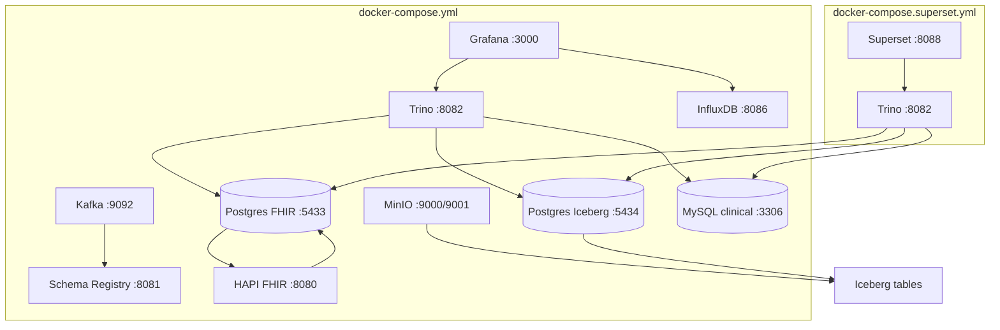

# Infrastructure

This document describes the containerized runtime: compose topology, ports,
Trino catalogs, per-service images/health, how the platform is bootstrapped,
and how to reset it.

- [Topology](#topology)
- [Services and ports](#services-and-ports)
- [Trino catalogs](#trino-catalogs)
- [Custom images](#custom-images)
- [Bootstrap](#bootstrap)
- [Environment](#environment)
- [Reset and maintenance](#reset-and-maintenance)

## Topology

Two compose files share the project name `healthcare-timeseries-lab`.

- `docker-compose.yml` — the core stack (Kafka, Schema Registry, MinIO,
  Postgres x2, HAPI, Trino, MySQL, InfluxDB, Grafana).
- `docker-compose.superset.yml` — the analytics overlay (Trino + Superset).
  Booting it also defines `htl-trino`, so a project can run both files
  (`docker compose -f docker-compose.superset.yml` targets the same stack).



## Services and ports

| Service | Image / build | Host:Container | Healthcheck | Notes |
|---------|---------------|----------------|-------------|-------|
| kafka | `confluentinc/cp-kafka:8.0.7` | `9092:9092` | topic list | KRaft, controller on `29093` |
| schema-registry | `confluentinc/cp-schema-registry:8.0.7` | `8081:8081` | `/v1/metadata/id` | subject `vitals-value` |
| minio | `minio/minio:latest` | `9000:9000`, `9001:9001` | (none) | S3-compatible, bucket `lake` |
| postgres-fhir | `postgres:16` | `5433:5432` | `pg_isready` | HAPI backing store |
| postgres-iceberg | `postgres:16` | `5434:5432` | `pg_isready` | Iceberg catalog metadata |
| hapi | `hapiproject/hapi:v8.12.0-1` | `8080:8080` | host-side polling | JRE-only image: no in-container shell; `init_infra.py` polls `/fhir/metadata` |
| trino (core) | build `./infra/trino` | `8082:8080` | `/dev/tcp/8080` | catalogs: `lake`, `mysql`, `fhir_pg` |
| mysql-clinical | `mysql:8.0.42` | `3306:3306` | `mysqladmin ping` | utf8mb4 |
| influxdb | `influxdb:2.7` | `8086:8086` | `/dev/tcp/8086` | org `healthcare`, bucket `telemetry` |
| grafana | build `./infra/grafana` | `3000:3000` | `/dev/tcp/3000` | anonymous viewer enabled |
| trino (overlay) | build `./infra/trino` | `8082:8080` | same | duplicated service only in the overlay file |
| superset | build `./infra/superset` | `8088:8088` | curl `/login/` | entrypoint auto-runs db upgrade/init/create-admin |

Named volumes: `kafka_data`, `minio_data`, `pg_fhir_data`, `pg_iceberg_data`,
`influxdb2_data`, `mysql_clinical_data`. Container names use the `htl-`
prefix (e.g. `htl-superset`).

`init_infra.py` waits on all health checks (HAPI by polling `/fhir/metadata`
from the host) and provisions the MinIO bucket, the Iceberg catalog tables,
and the `lake.lakehouse` schema/tables.

## Trino catalogs

| Catalog | Connector | Target | Notes |
|---------|-----------|--------|-------|
| `lake` | iceberg | MinIO bucket `lake` via `postgres-iceberg` metadata | tables in `lake.lakehouse`; internal MinIO endpoint |
| `mysql` | mysql | `htl-mysql-clinical` | schema `clinical` |
| `fhir_pg` | postgresql | HAPI Postgres | raw HAPI `hfj_*` tables |

The `mysql` connector uses the Trino-specific DDL grammar (see
[data_model](data_model.md)); the postgresql driver jar is vendored at
`infra/trino/lib/postgresql.jar`.

## Custom images

- **`infra/trino`** — base Trino image plus catalog properties, node/config/jvm
  tuning, JVM/JMX profiles, and the vendor Postgres JDBC jar.
- **`infra/grafana`** — provisions the Trino datasource and both dashboards
  (`vitals.json`, `business_questions.json`) read-only into the container.
- **`infra/superset`** — `FROM apache/superset:109402b`, installs
  `sqlalchemy-trino==0.4.0`, enables system site-packages, and applies
  `patch_trino_dialect.py` so `TrinoDialect.get_metrics` honors the
  `spark_trino_extra` hook (required for chart metrics). The Trino connection
  uses `trino://trino@trino:8080/lake` (real catalog `lake`, not `trino`).

## Bootstrap

```text
make infra-libs      # download infra/trino/lib/postgresql.jar (if absent)
make infra-up        # docker compose up -d --build
make init            # wait for health + provision bucket/catalogs/tables
# analytics overlay:
make -C . infra-up   # (core already running) — then:
docker compose -f docker-compose.superset.yml up -d superset
uv run python scripts/import_superset_dashboards.py   # idempotent
```

Manual equivalents:

```bash
docker compose up -d --build
uv run python scripts/init_infra.py
docker compose -f docker-compose.superset.yml up -d superset
uv run python scripts/import_superset_dashboards.py
```

## Environment

`.env` (see `.env.example`) drives compose and the scripts:

- `HTL_KAFKA_BOOTSTRAP_SERVERS=localhost:9092`, `HTL_SCHEMA_REGISTRY_URL`
- `HTL_MINIO_*` (`localhost:9000`, `minioadmin`/`minioadmin`, bucket `lake`),
  `TRINO_MINIO_ENDPOINT=http://minio:9000` (container-internal)
- `HTL_INFLUX_*`, `HTL_HAPI_BASE_URL=http://localhost:8080/fhir`
- `HTL_TRINO_URL=http://localhost:8082`, `HTL_TRINO_USER=trino`
- `KAFKA_CLUSTER_ID` (required by compose), `GRAFANA_ADMIN_PASSWORD`

## Reset and maintenance

| Task | Command |
|------|---------|
| Stop | `docker compose down` |
| Full reset (volumes) | `docker compose down -v` |
| Tail logs | `make infra-logs` / `docker compose logs -f` |
| Service status/health | `make infra-ps` / `docker compose ps` |
| Reset Superset metadata | stop + `rm -f infra/superset/instance/superset.db` + up again (entrypoint re-runs db upgrade/init/create-admin) |
| Re-import dashboards | `uv run python scripts/import_superset_dashboards.py` (skips existing) |

Known operational caveats:

- `hapi` has no shell/curl in-image; its health is checked from the host by
  `init_infra.py` instead of a container healthcheck.
- The Superset metadata DB is **SQLite on the bind-mounted `instance/` dir**;
  that directory is gitignored, so metadata is recreated on a fresh checkout
  by the import script.