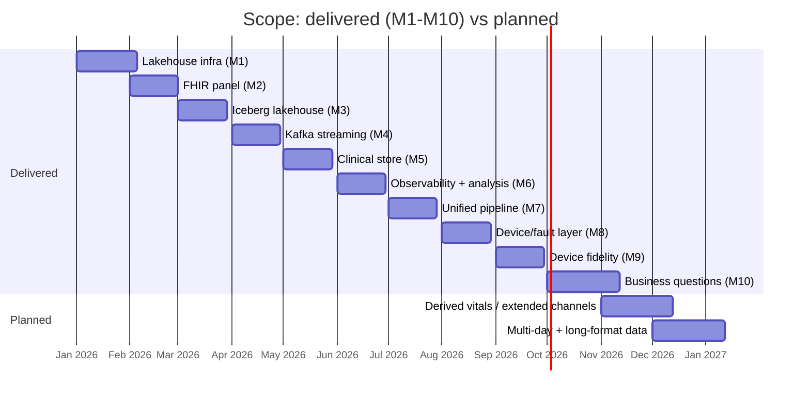

# Scope

What the Healthcare Time-Series Lab is, what it includes today (Milestones
1-10), what is intentionally out of scope, and where it is heading.

- [Purpose and audience](#purpose-and-audience)
- [Included: milestones](#included-milestones)
- [Included: assets](#included-assets)
- [Out of scope](#out-of-scope)
- [Data caveats](#data-caveats)
- [Roadmap](#roadmap)

## Purpose and audience

A **reproducible, containerized platform for learning and teaching
time-series software engineering and analytics** — streaming (Kafka/Avro),
lakehouse (MinIO/Iceberg/Trino), FHIR interoperability, SQL analytics, and
observability. It ships synthetic data and hands-on tutorials, and is aimed
at engineers and analysts who want realistic healthcare-shaped data without
real PHI.

> It is **not** a clinically validated physiological simulator. Output must
> not be used for diagnosis, treatment, or clinical decision-making.

## Included: milestones

| Milestone | Scope | Observe |
|-----------|-------|---------|
| M1 | Lakehouse infra: Kafka, Schema Registry, MinIO, Postgres x2, HAPI, Trino, InfluxDB | `docker compose ps` healthy; `scripts/init_infra.py` |
| M2 | FHIR vital-signs panel (`85353-1` Observation bundle) | `scripts/push_to_fhir.py` |
| M3 | Iceberg `lake.lakehouse.vitals` + analytics | `scripts/provision_lakehouse.py`, `run_lakehouse_analytics.py` |
| M4 | Kafka vitals streaming (Avro + Schema Registry) | `run_pipeline.py --scenario baseline` |
| M5 | MySQL `clinical.patients/encounters` via Trino | `scripts/run_clinical_store.py` |
| M6 | Grafana + Jupyter vitals analysis | `vitals_analysis.ipynb` |
| M7 | Unified simulate → Kafka → Iceberg → FHIR pipeline | `run_pipeline.py --scenario progressive_hypoxemia` |
| M8 | Device/fault layer (noise, precision, latency, dropout, drift, spikes, flatlines, disconnects; quality codes) | `run_pipeline.py` with/without `--no-device` |
| M9 | Device-fidelity analysis (observed vs true) | `device_vs_true_spo2.ipynb`, `analysis` package |
| M10 | Business questions: 9 SQL tutorials, 6 Superset dashboards, 8 Grafana panels, notebooks, ward data + truth table | `build_m10_notebooks.py`, `import_superset_dashboards.py`, `tests/test_tutorials.py` |

## Included: assets

- **Simulation**: patients, physiology engine, scenarios (`baseline`,
  `progressive_hypoxemia`, `tachycardia`), device layer, ground truth.
- **Streaming + lakehouse**: Kafka topic `vitals`, Avro schema, Iceberg
  `vitals`/`vitals_truth`, Trino gateway, MySQL clinical store, InfluxDB.
- **Analytics**: Trino SQL (9 DQL lessons), Jupyter (4 notebooks), Grafana
  (2 dashboards, 10 panels), Superset (6 dashboards), TablePlus/SQL clients.
- **Data scope**: six vitals channels — heart rate, SpO2, respiratory rate,
  temperature, systolic BP, diastolic BP (LOINC 8867-4/2708-6/9279-1/8310-5/
  8480-6/8462-4, panel 85353-1).
- **Interop**: HAPI FHIR, the `mysql`, `lake`, and `fhir_pg` Trino catalogs,
  and the REST-based Superset importer.

## Out of scope

Deliberately **not** implemented in the current platform:

- **Real-time/continuous streaming** — no running producer; data is written by
  finite batch runs and dashboards do not tick live.
- **Waveform data** (ECG/PPG/waveforms) — scalar vitals only.
- **Interventions & orders** — no medication, ventilation, or admission/transfer
  effects on physiology.
- **Multi-day history** — all telemetry fits in a single ~6-hour window
  (`2026-01-01 00:00 → 06:00 UTC`), which limits day-over-day / weekly /
  monthly SQL practice.
- **Long-format measurements, events/alarms tables, and dimension models** —
  the lakehouse is intentionally wide; some concepts that production teams
  would pre-digest as `events` or star schemas are left as the *target* of
  lessons instead.
- **Answer-checking harness** — lessons ship with goal text, not graded
  answers; correctness is verified manually or through `tests/test_tutorials.py`
  logic checks.
- **Anything clinical** — no diagnosis, alarm policy, or patient-safety claims.
- **Production-grade FHIR/Iceberg schema** — HAPI `hfj_*` tables and catalog
  metadata are infrastructure, not user-facing models.

## Data caveats

- All patients are fictional. Names, MRNs, and vitals are synthetic.
- Bidirectional realism limits: regular 5-second ticks with occasional
  duplicate-timestamp rows at the second-granularity topic layer; the database
  keeps microsecond timestamps, so lesson authors should expect (and can
  practice handling) same-timestamp duplicates in raw queries.
- Devote deliberate time to teaching *analytic gap-handling*: the dataset already
  ships deliberate dropouts/faults from the M8 device layer.

## Roadmap

Candidates already discussed with maintainers, in rough priority order:

1. **Derived vitals** — MAP, pulse pressure, shock index (cheap; big lesson value).
2. **Extended channels** — EtCO2, FiO2 + S/F ratio through the full pipeline
   (Avro → Iceberg → FHIR LOINC).
3. **Realism layer** — NIBP cadence, alarm/event stream materialization.
4. **30-day data** — enable day-over-day/weekly/monthly SQL patterns.
5. **Long-format measurements table** — practice `length`-normalized joins and
   pivot/UNNEST patterns.
6. **Answer-checking harness** — scripted golden-result comparisons for lessons.