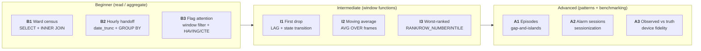

# Training & Tutorials

How to learn with the lab: the SQL lesson library, the companion notebooks,
the dashboards, and the live/offline execution model that makes the material
runnable with or without the compose stack.

- [Learning path](#learning-path)
- [The lesson library](#the-lesson-library)
- [Typical sessions](#typical-sessions)
- [Notebooks](#notebooks)
- [Dashboards](#dashboards)
- [Live vs snapshot execution](#live-vs-snapshot-execution)
- [Running the material](#running-the-material)
- [Verification](#verification)
- [Tips and caveats](#tips-and-caveats)

## Learning path

The material is a 3-tier progression over the Milestone 10 ward dataset
(vitals + truth table + clinical store; see [data_model](data_model.md)):



Expected backgrounds: **Beginner** needs basic SQL; **Intermediate** needs
SELECT/JOIN/GROUP BY fluency; **Advanced** builds on the intermediate
window-function vocabulary. Every tier also maps to a _business question_ a
clinician or quality team would actually ask, so learners leave with a
problem-solving framework, not just syntax.

## The lesson library

SQL lives in `sql/dql/{beginner,intermediate,advanced}/*.sql` — one file per
business question, each starting with a prose block describing the scenario,
the exact question, and the concepts taught. The questions were chosen to
align with clinical workflows (handoff, alarm review, quality benchmarking).

| Tier | Lesson | Business question | Concepts taught | Data world |
|------|--------|-------------------|-----------------|------------|
| Beginner | B1 — Ward census | Who was on the ward on Jan 1? | `SELECT`, `INNER JOIN`, `ORDER BY` | `mysql.clinical` |
| Beginner | B2 — Hourly handoff | What did each vital average every hour? | `date_trunc('hour', …)`, `GROUP BY`, `AVG` | `lake.lakehouse.vitals` |
| Beginner | B3 — Flag attention | Who desaturated 03:00–04:00? | `BETWEEN`, aggregate-then-filter (`HAVING`/CTE) | `vitals` |
| Intermediate | I1 — First drop | Where did Naomi's desaturation start? | `LAG` over a window, state transition | `vitals` |
| Intermediate | I2 — Moving average | Raw spike or real trend? | `AVG`/`ROWS` frames vs noise (M8) | `vitals` |
| Intermediate | I3 — Worst-ranked | Where does a reading sit in its patient's distribution? | `RANK` vs `ROW_NUMBER`, `NTILE` | `vitals` |
| Advanced | A1 — Episodes | How many distinct desaturation episodes? | gap-and-islands (island detection) | `vitals` |
| Advanced | A2 — Alarm sessions | 900 alarm ticks → how many real alarm events? | sessionization / burst collapsing | `vitals` |
| Advanced | A3 — Observed vs truth | Can we trust the monitor? | benchmark `vitals` vs `vitals_truth` | `vitals` + `vitals_truth` |

## Typical sessions

Suggested one-class-per-tier pacing (roughly 45–75 minutes each):

1. **Beginner session** — B1 builds the insight that telemetry must be joined
   to a relational layer to mean anything; B2 introduces time bucketing (the
   single most reused pattern in the dataset); B3 shows why you aggregate
   *before* filtering.
2. **Intermediate session** — I1 uses `LAG` to find the exact transition
   tick; I2 confronts noisy device data (from the M8 layer) with a smoothed
   series; I3 learns ranking within each patient's own distribution.
3. **Advanced session** — A1 teaches gap-and-islands on a real trace; A2
   collapses a 900-tick alarm burst into events with a quiet-window; A3
   benchmarks the device by comparing observed rows against `vitals_truth`
   (per-minute error).

Learners who want an integration challenge should reproduce a dashboard
panel: every Superset/Grafana panel maps back to one of these lessons
(see [Dashboards](#dashboards)).

## Notebooks

Companion Jupyter notebooks (Kernel `python3`) give a guided,
execution-friendly version of each track plus the analytics deep-dives:

| Notebook | Milestone | What it covers |
|----------|-----------|----------------|
| `vitals_analysis.ipynb` | M6 | Reading `lake.lakehouse.vitals`, pandas + plotting an analysis walk-through |
| `1_progressive_hypoxemia_analysis.ipynb` | M7 | Scenario deep-dive over `output/progressive_hypoxemia.csv` produced by `run_hypoxemia.py` |
| `device_vs_true_spo2.ipynb` | M9 | Observed-vs-true: overlay, per-channel bias/MAE/RMSE, latency, fault-window demo |
| `tutorial_business_beginner.ipynb` | M10 | B1–B3 as executable cells (live SQL → DataFrames) |
| `tutorial_business_intermediate.ipynb` | M10 | I1–I3 as executable cells |
| `tutorial_business_advanced.ipynb` | M10 | A1–A3 as executable cells |

The three `tutorial_business_*.ipynb` files are generated from the lesson
library by `scripts/build_m10_notebooks.py` and commit the rendered outputs
so a freshly-checked-out repo shows answers even before the stack runs.

## Dashboards

Panels make the same lessons visual:

- **Grafana** — `Lakehouse Vitals` (M6) and `Business Questions` (M10), the
  latter's 8 panels mirroring B1–A3 themes on the live lakehouse.
- **Superset** (6 dashboards) — higher-fidelity versions of B1, B2, I1, I2,
  A1, A2 built programmatically via `scripts/import_superset_dashboards.py`
  (`infra/superset/dashboards/*.json`, see [infrastructure](infrastructure.md)).

| Lesson | Grafana panel(s) | Superset dashboard |
|--------|------------------|--------------------|
| B1 Ward census | yes | `b1_ward_census` |
| B2 Hourly handoff | yes | `b2_hourly_handoff` |
| B3 Flag attention | yes | — |
| I1 First drop | yes | `i1_first_drop` |
| I2 Moving average | yes | `i2_moving_average` |
| I3 Worst-ranked | yes | — |
| A1 Episodes | yes | `a1_desaturation_episodes` |
| A2 Alarm sessions | yes | `a2_alarm_sessions` |
| A3 Observed vs truth | yes | — |

## Live vs snapshot execution

The tutorials package (`src/healthcare_timeseries_lab/tutorials/__init__.py`)
runs every lesson two ways:

- **live** — executes the lesson SQL against the running Trino lakehouse,
  returning the last result set as a DataFrame (fresh answers);
- **parquet** — reads a pre-rendered snapshot from `datasets/m10/lessons/`
  (`{tier}__{stem}.parquet`), used when the compose stack is down.

`run_lesson` prefers live and silently falls back to the snapshot on any
stack failure, so notebooks work with or without infrastructure. Snapshots
are regenerated by `scripts/build_m10_snapshots.py` with the stack up.

## Running the material

Prerequisites and exact commands:

```bash
# 1. Stack up + provision (if not already running)
make infra-up && make init
docker compose -f docker-compose.superset.yml up -d superset

# 2. Generate the ward dataset (vitals, vitals_truth, clinical, parquet)
uv run python scripts/generate_m10_dataset.py

# 3. Build the tutorial notebooks (also refreshes commits' outputs)
uv run python scripts/build_m10_notebooks.py

# 4. Import the Superset dashboards (idempotent)
uv run python scripts/import_superset_dashboards.py

# 5. Execute the notebooks (with stack up)
uv run jupyter nbconvert --to notebook --execute --inplace \
    notebooks/tutorial_business_beginner.ipynb
uv run jupyter nbconvert --to notebook --execute --inplace \
    notebooks/tutorial_business_intermediate.ipynb
uv run jupyter nbconvert --to notebook --execute --inplace \
    notebooks/tutorial_business_advanced.ipynb
```

Offline (stack down), steps 3–5 still work: the notebooks fall back to the
committed parquet snapshots in `datasets/m10/lessons/`.

Interactive options: browse the dashboards (Grafana `http://localhost:3000`,
Superset `http://localhost:8088`, admin/admin), or query the lakehouse
directly in SQL Lab / TablePlus / the Python `trino` client.

## Verification

- `tests/test_tutorials.py` (7 tests) checks the lesson registry, tiers, and
  that every lesson has a non-empty SQL file — pure logic, no infra.
- Snapshot integrity: `scripts/build_m10_snapshots.py` regenerates all nine
  parquet snapshots against a live stack; rebuild and diff if the schema or
  dataset changes.
- Lesson outputs are committed inside the notebooks, so a reviewer can see
  expected rows/panels without rerunning anything.

## Tips and caveats

- The engine is **Trino dialect**: great for `LAG`/`LEAD`, `ROWS`/`RANGE`
  frames, `date_diff`, `UNNEST`, recursive CTEs and `MATCH_RECOGNIZE`
  (13+ DQL lessons exercise these against a real, partitioned Parquet table).
- Same-clock duplicates: the topic layer can hold duplicate timestamps for a
  patient; the database retains microsecond timestamps, so raw queries may
  show ties — useful practice for `RANK` vs `ROW_NUMBER` (deliberate, see
  Lesson I3).
- There is **no graded answer harness**; correctness is validated manually or
  via the tutorial tests. If you extend the library, update
  `LESSON_STEMS`/`TIERS` in `tutorials/__init__.py` and regenerate snapshots.
- i3 and a3 are SQL+notebook only — they have no Superset dashboard yet
  (A3's truth table is best read as tables, not panels).